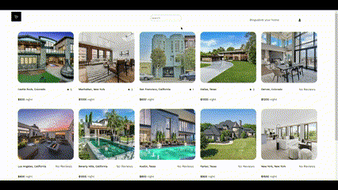
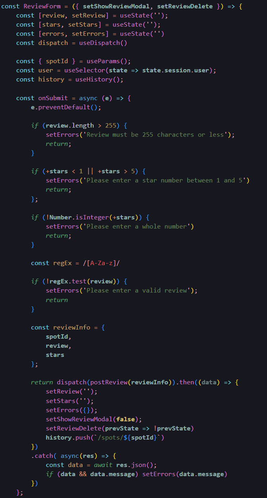

# BingusBnB
BingusBnB is a fullstack web application. Users can browse spots, leave reviews, and host, edit, and delete their own locations. The initial app was built in two weeks, and is meant to be clone of AirBnB. 

[Click me to visit the live site](https://bingusbnb.herokuapp.com/)

Hosting a Spot

Spot Thunks and Reducer

Leave a Review

Review Form Component

This code snippet showcases the function that is invoked when a user submits a review.

# Technologies Used
- React.js
- Redux
- Express
- Sequelize
- Javascript
- HTML
- CSS

# How to Launch App Locally
1. Copy the repo link from above
2. Type ``git clone <repo-link>`` into your terminal in the directory you desire
3. Move into the new directory and run npm install at root to install dependencies
4. Move into the frontend and backend folders and npm install to install dependencies respectively
5. Move into the backend directory and run npm start to start the backend server
6. Make a new terminal and move into the frontend folder. Run npm start and navigate to http://localhost:3000/ in your browser
